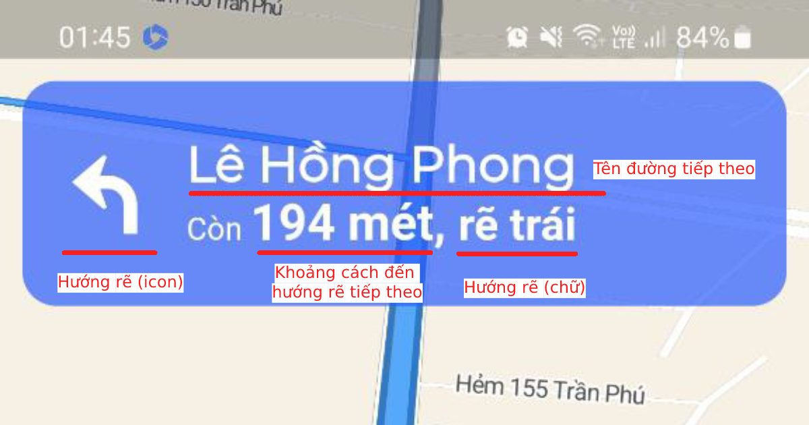
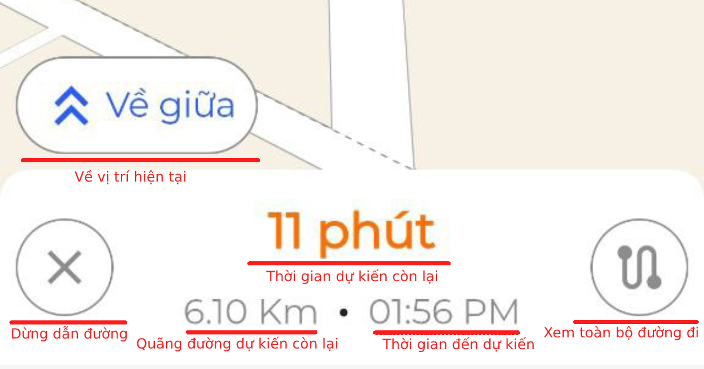

# Vietmap Flutter Navigation

[ </p>](https://vietmap.vn/maps-api)

Contact [vietmap.vn](https://bit.ly/vietmap-api) to register a valid key.

## Getting started

Add library to pubspec.yaml file
```yaml
  vietmap_flutter_navigation: latest_version
```

Check the latest version at [https://pub.dev/packages/vietmap_flutter_navigation](https://pub.dev/packages/vietmap_flutter_navigation)
 
or run this command in the terminal to add the library to the project:
```bash
  flutter pub add vietmap_flutter_navigation
```
## Android config


Add the below code to the build.gradle (project) file at path **android/build.gradle**

```gradle
 maven { url "https://jitpack.io" }
```


at the repositories block


```gradle
  allprojects {
      repositories {
          google()
          mavenCentral()
          maven { url "https://jitpack.io" }
      }
  }
```

Upgrade the minSdkVersion to a minimum is 24 in the build.gradle (app) file, at path **android/app/build.gradle**
```gradle
  minSdkVersion 24
```

## iOS config
Add the below codes to the Info.plist file. Replace your API key to **YOUR_API_KEY_HERE** 
```ruby
  <key>VietMapURL</key>
  <string>https://maps.vietmap.vn/api/maps/light/styles.json?apikey=YOUR_API_KEY_HERE</string>
  <key>VietMapAPIBaseURL</key>
  <string>https://maps.vietmap.vn/api/navigations/route/</string>
  <key>VietMapAccessToken</key>
  <string>YOUR_API_KEY</string>  
  <key>NSLocationAlwaysAndWhenInUseUsageDescription</key>
  <string>Your request location description</string>
  <key>NSLocationAlwaysUsageDescription</key>
  <string>Your request location description</string>
  <key>NSLocationWhenInUseUsageDescription</key>
  <string>Your request location description</string>
```

Upgrade min ios version to 12.0 in the Podfile (iOS) file, at path **ios/Podfile** (uncomment the line below)

```ruby
  platform :ios, '12.0' 
```

In your terminal, cd to the ios folder and run the command below to install the pod file
```bash
  cd ios && pod install
```

- If the project shows an issue when upgrading to the new version when running the `pod install` command, please remove the `ios/.symlinks`, `ios/Pods` folders, and `Podfile.lock` file, then run the `pod install --repo-update` command to update the pod file. 


## Main characteristics
### Define necessary variables
```dart
  // Define the map options
  late MapOptions _navigationOption;

  final _vietmapNavigationPlugin = VietMapNavigationPlugin();

  List<WayPoint> wayPoints = [
    WayPoint(name: "origin point", latitude: 10.759091, longitude: 106.675817),
    WayPoint(
        name: "destination point", latitude: 10.762528, longitude: 106.653099)
  ];
  /// Display the guide instruction image to the next turn
  Widget instructionImage = const SizedBox.shrink();

  Widget recenterButton = const SizedBox.shrink();
  
  /// RouteProgressEvent contains the route information, current location, next turn, distance, duration,...
  /// This variable is update real time when the navigation is started
  RouteProgressEvent? routeProgressEvent;
  
  /// The controller to control the navigation, such as start, stop, recenter, overview,... 
  MapNavigationViewController? _navigationController;
```
Add the `initialize` function to `initState` function to initialize the map options
```dart
  @override
  void initState() {
    super.initState();
    initialize();
  }

  Future<void> initialize() async {
    if (!mounted) return;
    _navigationOption = _vietmapNavigationPlugin.getDefaultOptions();
    /// set the simulate route to true to test the navigation without the real location
    _navigationOption.simulateRoute = false;

    _navigationOption.apiKey =
        'YOUR_API_KEY_HERE';
    _navigationOption.mapStyle =
        "https://maps.vietmap.vn/api/maps/light/styles.json?apikey=YOUR_API_KEY_HERE";

    _vietmapNavigationPlugin.setDefaultOptions(_navigationOption);
  }
```
- Replace your apikey which is provided by VietMap to YOUR_API_KEY_HERE tag to the application work normally

### Display the Navigation view, include map view, route and navigation
```dart
  NavigationView(
    mapOptions: _navigationOption,
    onMapCreated: (controller) {
      _navigationController = controller;
    },
    onRouteProgressChange: (RouteProgressEvent routeProgressEvent) {
      setState(() {
        this.routeProgressEvent = routeProgressEvent;
      });
      _setInstructionImage(routeProgressEvent.currentModifier,
          routeProgressEvent.currentModifierType);
    },
  ),
```

### Set instruction icon from routeProgress data.
```dart
  _setInstructionImage(String? modifier, String? type) {
    if (modifier != null && type != null) {
      List<String> data = [
        type.replaceAll(' ', '_'),
        modifier.replaceAll(' ', '_')
      ];
      String path = 'assets/navigation_symbol/${data.join('_')}.svg';
      setState(() {
        instructionImage = SvgPicture.asset(path, color: Colors.white);
      });
    }
  }
```
We use [flutter_svg](https://pub.dev/packages/flutter_svg) to display the svg image.

Instruction icon [here](./example/assets/navigation_symbol), copy and paste to your project.

Figma design for the instruction [here](https://www.figma.com/file/rWyQ5TNtt6E5l8tPEE9Tkl/VietMap-navigation-symbol?type=design&node-id=1%3A457&mode=design&t=yszRZCTouxAdYXXJ-1)

### Add banner instructions to display icon, route name, next turn guide,...
```dart
  BannerInstructionView(
    routeProgressEvent: routeProgressEvent,
    instructionIcon: instructionImage,
  )
```

### Add the Bottom view, which contains the overview route, recenter, and the stop navigation button.
```dart
  BottomActionView(
    recenterButton: recenterButton,
    controller: _navigationController, 
    routeProgressEvent: routeProgressEvent
  )
```

You can customize all of the widgets above to fit your design.
All data is provided by the `routeProgressEvent` variable.
### Add the dispose function for the navigation controller
```dart
  @override
  void dispose() {
    _navigationController?.onDispose();
    super.dispose();
  }
```
### Useful function
```dart
  /// Find a new route between two locations, 
  /// waypoint1 is origin, waypoint2 is destination.
  _navigationController?.buildRoute(wayPoints: <Waypoint>[waypoint1,waypoint2]);

  /// Start navigation, call after the buildRoute have a response.
  _navigationController?.startNavigation();


  /// Find route and start when the api response at least 1 route
  _navigationController?.buildAndStartNavigation(
      wayPoints: wayPoints: <Waypoint>[waypoint1,waypoint2],
      profile: DrivingProfile.drivingTraffic);
  
  /// recenter to the navigation
  _navigationController?.recenter();

  /// Overview the route
  _navigationController?.overview();

  /// Turn on/off the navigation voice guide
  _navigationController?.mute();

  /// Stop the navigation
  _navigationController?.finishNavigation();
```

## Add a marker to the map
  We provide the `addImageMarkers` function to add multiple marker to the map
  - Add a marker from assets image  

### Marker from assets image
```dart
  /// Add a marker to the map
  List<Marker>? markers = await _navigationController?.addImageMarkers([
    Marker(
        imagePath: 'assets/50.png',
      latLng: const LatLng(10.762528, 106.653099)),
    Marker(
        imagePath: 'assets/40.png',
        latLng: const LatLng(10.762528, 106.753099)),
  ]);
``` 

## Troubleshooting
- We strongly recommend you call the **_navigationController?.buildRouteAndStartNavigation()** in a `button` or `onMapRendered` callback, which is called when the map is rendered successfully to ensure that the application does not crash while executing some function while our SDK is rendering the map. 
```dart
  onMapRendered: () {
    _navigationController?.buildAndStartNavigation(
    wayPoints: wayPoints: <Waypoint>[waypoint1,waypoint2],
    profile: DrivingProfile.drivingTraffic);  
  }
```

Demo code [here](./example/lib/main.dart)

We have a demo app with [flutter_bloc](https://pub.dev/packages/flutter_bloc) and clean architecture pattern [here](https://github.com/vietmap-company/flutter-navigation-example).
Please clone and run the app to see how it works.

You can also [download the example app](https://vmnavigation.page.link/navigation_demo) to see how it works.


## Note: Replace apikey which is provided by VietMap to all YOUR_API_KEY_HERE tag to the application work normally


[ </p>](https://vietmap.vn/maps-api)
Email us: [maps-api.support@vietmap.vn](mailto:maps-api.support@vietmap.vn)

Vietmap API and price [here](https://vietmap.vn/maps-api)

Contact for [support](https://vietmap.vn/lien-he)

Vietmap API document [here](https://maps.vietmap.vn/docs/map-api/overview/)

Have a bug to report? [Open an issue](https://github.com/vietmap-company/flutter-map-sdk/issues). If possible, include a full log and information which shows the issue.


Have a feature request? [Open an issue](https://github.com/vietmap-company/flutter-map-sdk/issues). Tell us what the feature should do and why you want the feature.
 